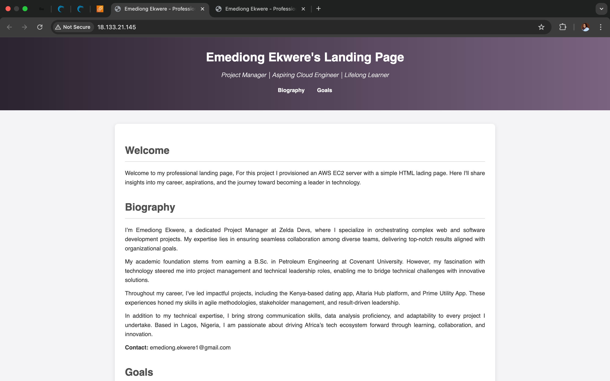

### Student Name: Emediong Ekwere
#### Altschool ID: ALT/SOE/024/1194
#### Project IP address: http://18.133.21.145
#### Project public DNS: http://ec2-18-133-21-145.eu-west-2.compute.amazonaws.com/


*Figure 1 A screenshot of Landing Page*


# DOCUMENTATION FOR SERVER PROVISIONING.

## Steps to Launching an Ubuntu Server on AWS

### Step 1: Logging in to my AWS Console

### Step 2: Launching an EC2 Instance
1. I clicked on **EC2** under "Compute" services.
2. I clicked on  **Launch Instances**.
3. I set my server name to `Altschool_2ndsem_Exam`
4. I Choose an **Ubuntu Server** 24.04 LTS (HVM) which is free tier eligible, 
   -then I Selected an instance type `t2.micro` which is also on the free teir.
5. I created a new key pair and named it `emediong-altschoolkey.pem`
6. For the network settings,  I proceeded with the Default VPC, subnet and auto assign public IP.
   - I configured the security group and added inbound rules:
     - **HTTP (port 80)**: to Allow from `0.0.0.0/0` and `::/0`. (to allow Http traffic from the internet)
     - **SSH (port 22)**: to Allow from my public IP to restrict access.
7. I selcted the 8GB storage which is on the free teir.   
8. Going to the summary section of my set up screen, I set the number of instances to one and proceeded to launch the instance and download the `.pem` key file.
9. Now my EC2 server is up and running.
---

### Step 3: Assigning an Elastic Ip address to my EC2 instance 
1. I clicked on the Hamburger Botton on my console, scrolled down to the **Network and Security** section and selected Elastic IP's.
2. I clicked 'Allocate Elastic IP'
3. I renamed the IP address `Altschool-Exam` 
4. I clicked on the allocated IPv4 address.
5. I clicked on the Associate Elastic IP address and proceeded to associate the Elastic Ip address to my EC2 instance named 'Altschool_2ndsem_Exam.
( Now When I reboot my server, the Ip address won't change with each reboot.)
---

### Step 4: Connecting to my Instance Via SSH
1. I set up a directory contaning the .pem file I downloaded earlier while launching my instance.
2. I launch my terminal and cd into the directory contaiing my .pem file
3. To set up proper permissions for my key.pem file so that my machine can read the file, I run the command
```bash
chmod 400 emediong-altschoolkey.pem
``` 
 
4. Going back to my EC2 instance I click on 'connect and select the SSH client option'.
3. I proceeded to copy the public DNS of my instance and run the command 
```
ssh -i emediong-altschoolkey.pem ubuntu@ec2-18-133-21-145.eu-west-2.compute.amazonaws.com` to SSH into my server.
```

 6. Now I am in the termial of my AWS server.
---

### step 5: Updating and installing Apache
1. Before installing apache I ran the command `apt update` from my root user
2. then the following sequence of commands 
```bash
- apt upgrade
- apt install apache 2
```
4. After the installation, I proceeded to check Apache2 status 
```bash
 systemctl status apache2
 ``` 
5. I enabled Apache to start on boot `systemctl eneable aapache2`
6. To test my apache, I open a web browser and navigate to my EC2 instances's public IP address.  
(Awesome now the default apache landing page is showing)
---

### Step 6: Enabling firewall `UFW`
1. To setup fire wall first I Checked the status `ufw status` this shows that my ufw is inctive.
2. To enable ufw I ran the command `ufw enable`
3. i went ahead to set the rules `ufw allow 80`, `ufw allow 22` or `ufw allow "Apache Full"`
4. then to effect the changes I ran the command `ufw reload`

### Step 7: Deploying an HTML page
1. I navigated to the default web directory for Apache 
```bash
cd /var/www/html
```
2. I the ran a chmod command to make the directory writable 
```bash
chmod a+rwx /var/www/html
```
3. I proceeded to rewrite the default apache html with the following.
 ```
nano index.html
```
- I Saved and exit (`Ctrl+O`, `Enter`, `Ctrl+X`).


## Conclusion
Now my Ubuntu server is now running an Apache web server with a deployed HTML page as seen above.


